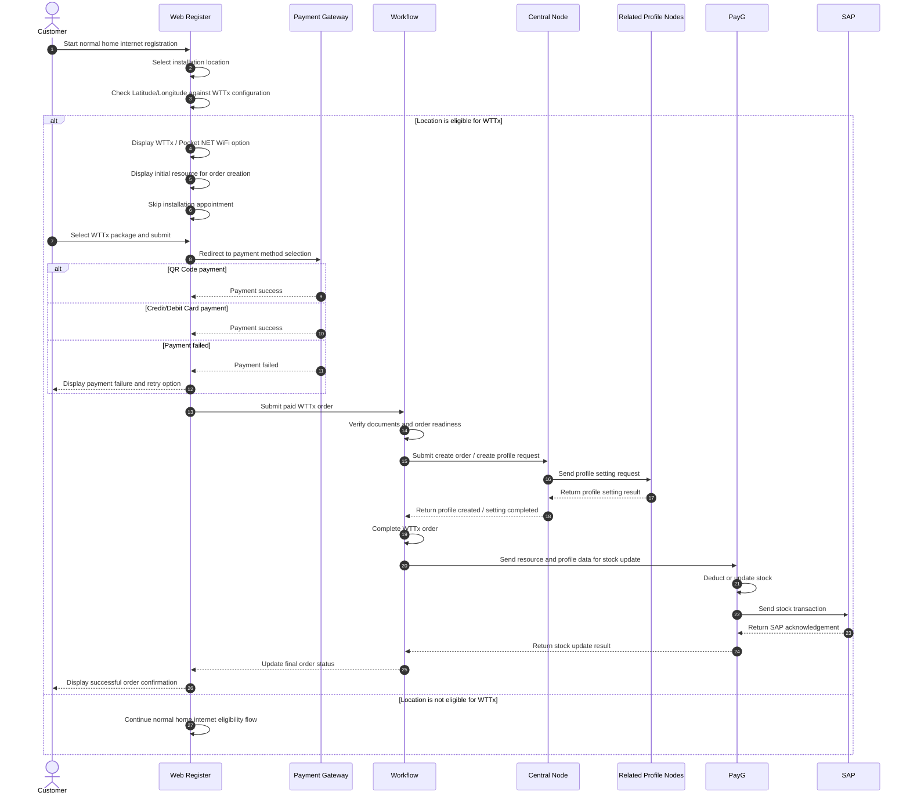

# Flow Diagram: WTTx / Pocket NET WiFi Registration

## End-to-End Sequence Flow

## Flow Summary

1. The customer starts the registration journey from Web Register, similar to the normal home internet flow.
2. Web Register checks the selected Latitude/Longitude to determine whether the location is eligible for WTTx.
3. If eligible, Web Register displays the WTTx package/resource and skips the installation appointment step.
4. After package selection, the customer must complete payment by QR Code or Credit/Debit Card.
5. After payment success, Web Register submits the paid WTTx order to Workflow.
6. Workflow verifies documents and order readiness.
7. Workflow sends the order to the Central Node to create the order/profile and trigger profile setting in related nodes.
8. After profile setting is completed, the result is returned to Workflow.
9. Workflow completes the order and sends resource/profile data to PayG for stock update before SAP posting.
10. Web Register displays the final order result to the customer.
