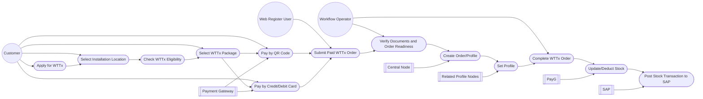

# Use Cases: WTTx / Pocket NET WiFi

## Use Case Diagram

## UC-001: Apply for WTTx via Web Register

Primary Actor: Customer

Supporting Systems:
- Web Register
- Payment Gateway
- Workflow
- Central Node
- Related Profile Nodes
- PayG
- SAP

Preconditions:
- Customer accesses Web Register.
- WTTx location configuration exists.
- WTTx package and resource are available.
- Payment channels are available.

Main Flow:
1. Customer starts normal home internet registration.
2. Customer selects installation location.
3. Web Register checks Latitude/Longitude against WTTx configuration.
4. Web Register displays WTTx option and resource if the location is eligible.
5. Customer selects WTTx package.
6. Web Register skips installation appointment.
7. Customer selects payment method.
8. Customer completes payment.
9. Web Register submits paid WTTx order to Workflow.
10. Workflow verifies documents and order readiness.
11. Workflow submits create order/profile request to Central Node.
12. Central Node sends profile setting request to related nodes.
13. Related nodes return setting result.
14. Central Node returns profile created result to Workflow.
15. Workflow completes the order.
16. Workflow sends resource/profile data to PayG.
17. PayG updates/deducts stock and sends transaction to SAP.
18. SAP acknowledges transaction.
19. PayG returns stock update result to Workflow.
20. Workflow/Web Register updates final order status.

Alternative Flows:
- A1: Location is not eligible for WTTx: Web Register continues normal home internet flow.
- A2: Resource is not available: Web Register prevents WTTx order submission.
- A3: Payment fails: Web Register displays payment failure and does not submit order to Workflow.
- A4: Document verification fails: Workflow rejects or requests correction.
- A5: Profile creation fails: Workflow updates status to failed/pending for operational handling.
- A6: PayG/SAP fails: System records the transaction for retry or reconciliation.

Postconditions:
- WTTx order is completed after profile creation.
- Stock/resource transaction is updated in PayG and SAP.
- Customer can receive final order status.

## UC-002: Update Stock after Profile Creation

Primary Actor: Workflow

Supporting Systems:
- PayG
- SAP

Preconditions:
- WTTx profile has been created successfully.
- Resource/profile data is available.

Main Flow:
1. Workflow completes the WTTx order after profile creation.
2. Workflow sends resource/profile data to PayG.
3. PayG validates resource and stock information.
4. PayG deducts or updates stock.
5. PayG sends the stock transaction to SAP.
6. SAP acknowledges the transaction.
7. PayG returns the result to Workflow.

Postconditions:
- Stock has been updated.
- SAP receives the stock transaction.
- Workflow has stock update result for tracking.
